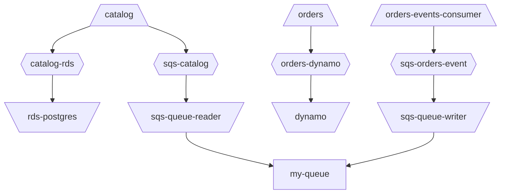

# Primaza Tools

This repository contains a set of companion tools for [Primaza](https://github.com/primaza/primaza).

## primaza-mon

Use this tool to identify links between workloads and services in a Primaza tenant.
The tool can output the result as JSON, Mermaid, or HTML.

Download the binary or compile it yourself. Then execute `primaza-mon --help` for information on how to use the tool.

### Example

You can setup a test environment using the script `hack/create_env.sh`.
Then execute the following command:

```console
primaza-mon get connections primaza-mytenant -o html > primaza-mytenant-graph.html
```

The result would be similar to the following:


